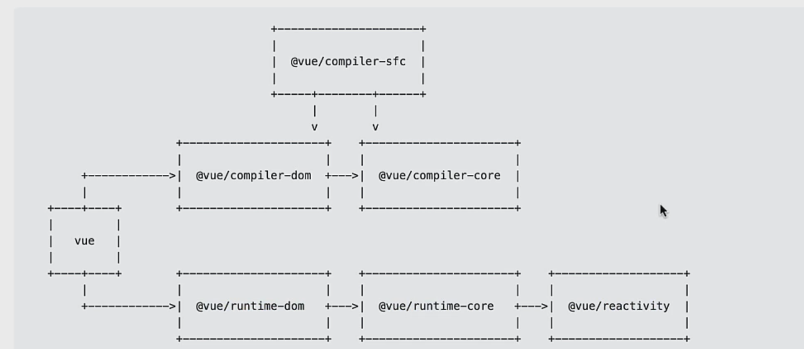

## mini-vue

## 项目介绍

为了深入学习 vue 源码，我打算从 0 到 1 实现一个 mini vue 框架，

项目把 vue 的核心模块抽离出来并一一实现，包括：

-   响应式模块 reactivity

-   运行时模块 runtime-core 和 runtime-dom

-   编译模块 compiler

各模块的主要功能都实现了，组织结构大抵和官方相同，各模块可以独立工作：

## 实现

### 配置环境

-   集成 jest 单元测试
-   集成 ts
-   集成 rollup 打包

### reactivity

-   reactive
-   基本 effect

    -   实现 ReactEffect 类
    -   track 收集依赖 和 trigger 触发依赖

-   完善 effect

    -   返回 runner
    -   effect 第二个参数 scheduler
    -   stop 方法

-   readonly 的实现
-   isReactive 和 isReadonly 的实现
-   支持嵌套 reactive
-   支持嵌套 readonly
-   实现 shallowReadonly
-   实现 isProxy
-   ref 的实现， 实现 RefImpl 类
-   实现 isRef 和 unRef
-   实现 proxyRef
-   实现 computed

### runtime-core

-   支持组件类型
-   支持 element 类型
-   初始化 props
-   setup 可获取 props 和 context
-   实现组件代理对象 proxy
-   支持 component emit
-   支持 provide / inject
-   可以在 render 中获取 setup 返回的对象
-   支持最基础的 slots，默认插槽和具名插槽
-   支持 getCurrentInstance，在 setup 中获取组件实例
-   支持自定义渲染器，可传入 DOM 接口、canvas 接口
-   支持 element 更新，采用 双端（快速） diff 算法
-   支持 组件更新
-   支持 nextTick

### runtime-dom

-   适合 DOM 的渲染器

### compiler-core

-   解析插值
-   解析 element
-   解析 text
-   实现 parse
-   实现 transfrom
-   实现 generate
-   支持简单 template --> render 函数
